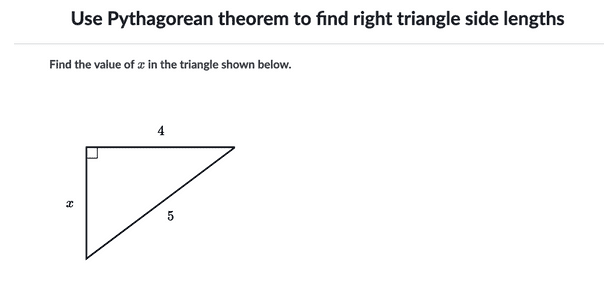

### Summary

In a recently created <a href="/prototypes/celltower" target="_blank">cell tower prototype</a>, a digital problem designed to help students learn the Pythagorean Theorem, I attempt to show how contextualizing a math problem can help students:

-- Use multiple ways to solve real world problems, not just the one taught in the current lesson.

-- Realize that math can play an important role in making impactful decisions that affect the lives of many people.

Part 1 highlights my own teaching experiences and research on culturally responsive mathematics that inspired me to create this prototype.

### Culturally Responsive Mathematics

When I taught high school chemistry, I spent a significant amount of my time taking problems from textbooks and figuring out ways to connect them to students' lives or contextualize them so that they could at least see how solving the problem would be important for a professional chemist.

Recently, I became interested to see if there was any research supporting the efficacy of this method and stumbled upon culturally responsive teaching. While cultural responsiveness places a greater emphasis on leveraging students' existing knowledge and sociocultural background to help them solve problems, it similarly wants to contextualize a problem to make it meaningful to a student's life.

In a <a href="https://news.ku.edu/2019/04/19/study-examines-benefits-teaching-math-culturally-responsive-ways" target="_blank">research synthesis</a> that analyzed 35 peer reviewed studies on culturally responsive mathematics, I found a couple of points particularly interesting:

> The studies in the synthesis prepared students to use multiple strategies to solve problems and justify their solutions.

> Several studies also situated mathematics problem-solving within the context of social justice issues, such as power relations, societal oppression and global poverty.

I consider both the above goals of encouraging multiple solutions and contextualizing lessons in larger social issues worthwhile, but largely aspirational or secondary goals for teachers. I've found that many problems provided in digital lessons or textbooks focus on checking students' understanding for a very specific standard. As a result, the problem is constructed in a way that also leads students to only have that one way of solving a problem. Using the Pythagorean theorem as an example, imagine a problem displaying a triangle with two sides with only one remaining side to be calculated

<small>Khan Academy Example</small>

 

These problems may be effective in checking mastery of the pythagorean theorem, but it's hard to imagine another way to solve this problem. Sinilarly, because of the narrow scope of the problem, students do not immediately connect how solving a math problem can inform decisions they make in their daily lives, much less larger social issues.

Wanting to explore how math lessons could create opportunities for the above goals, I continued reading more literature on culturally responsive mathematics teaching (CRMT), including a <a href="https://www.curriculumassociates.com/-/media/mainsite/files/ready-classroom-mathematics/ready-classroom-mathematics-cultural-responsiveness-whitepaper-2019.pdf" target="_blank">white paper</a> on the topic that highlighted one example of a "lesson focused on identifying possible locations for a new cell phone tower" to teach students the Pythagorean theorem. After reviewing the <a href="https://www.scribd.com/document/366617413/tacib-cell-towers-unit?secret_password=QSO3ygjBeFnOFdO3seZ4#from_embed" target="_blank">teacher resources</a> provided for this lesson, I noted the following:

1. The lesson taught a couple of ways students could determine the best location of a cell tower, which included the Pythagorean theorem, but also included applying translations to circles, another <a href="http://www.corestandards.org/Math/Content/8/G/A/2/" target="_blank"> Common Core state standard</a>.
1. The ultimate outcome of the unit is students' writing an argumentative essay to explain where cell towers should be built. In order to justify their results, students needed to understand a bit about the science behind waves and their application to information transfer (<a href="https://www.nextgenscience.org/dci-arrangement/ms-ps4-waves-and-their-applications-technologies-information-transfer" target="_blank">a next gen science standard</a>!), read news articles about citizens' concerns with cell towers being built in their neighborhood, and of course, using math to inform the placement of those towers. By providing the context of helping government officials determine where to build towers, the lesson provides an example of how applying math can help people make more informed about decisions that impact many people in the real world.

Though I appreciated the interdisciplinary nature of the unit, I was concerned about the length of the unit, which would likely take at least a week to complete. The reality for many teachers is they're pressured by the state assessment to cut pieces that might not be essential to mastering the core standard. I can imagine teachers wishing there were a more bite-sized version of this lesson that would still capture the essence of culturally responsive mathematics, but in a more compact format.

In part 2, I'll explain the process of designing this lesson and developing it digitally.

#### Links and Additional Resources

- <a href="https://news.ku.edu/2019/04/19/study-examines-benefits-teaching-math-culturally-responsive-ways" target="_blank">Overview of Culturally Responsive Mathematics Teaching: A Research Synthesis</a>
- <a href="https://www.scribd.com/document/366617413/tacib-cell-towers-unit?secret_password=QSO3ygjBeFnOFdO3seZ4#from_embed" target="_blank">Transforming Academic and Cultural Identidad through Biliteracy (Tacib)</a> - Cell tower example
- <a href="https://www.curriculumassociates.com/-/media/mainsite/files/ready-classroom-mathematics/ready-classroom-mathematics-cultural-responsiveness-whitepaper-2019.pdf" target="_blank">Culturally Responsive Mathematics Teaching White Paper </a> - White paper highlighting some examples of culturally responsive teaching
- <a href="https://secure.edweek.org/media/181113presentation.pdf" target="_blank">EdWeek Webinar Presentation with Teacher Examples</a> - Webinar slides related to white paper that has more teacher examples
- <a href="https://www.edutopia.org/article/bringing-culturally-responsive-lens-math-class" target="_blank">Bringing a Culturally Responsive Lens to Math Class</a> - Edutopia post about how the author created a culturally responsive unit on police brutality
