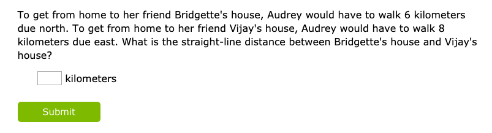
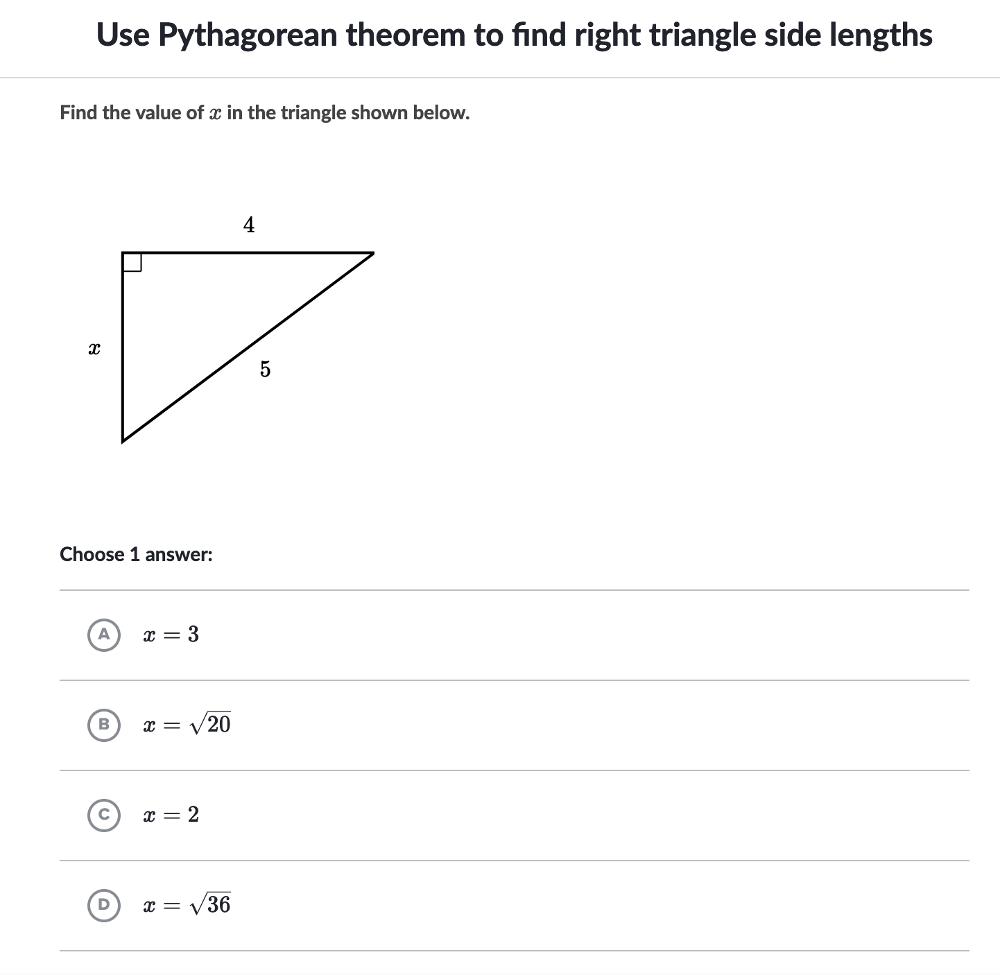

import PrototypeOne from "./prototype1.tsx";
import PrototypeTwo from "./prototype2.tsx";
import PrototypeThree from "./prototype3.tsx";

<i>
  How culturally responsive math inspired me to create a digital prototype for
  teaching the Pythagorean theorem.
</i>

### Current Digital Pythagorean Theorem Problems

Before designing this lesson, I analyzed how a few commonly used digital tools approached this problem. Here are a couple examples from IXL and Khan Academy:

#### IXL - [(More Examples)](https://www.ixl.com/math/grade-7/pythagorean-theorem-find-the-length-of-the-hypotenuse)

#### Khan Academy - [(More Examples)](https://www.khanacademy.org/math/basic-geo/basic-geometry-pythagorean-theorem/geo-pythagorean-theorem/e/pythagorean_theorem_1)

These questions can be effective for a quick check of student understanding to determine whether students
have understood how to apply the formula. If a teacher were to only provide students with questions like these throughout the year, however, it's easy to see why many students might not see themselves as "math people".

If we were to translate the cell tower lesson described in <a href="./cell-tower-1" target="_blank">part 1</a>, to fit one of these common digital formats, it'd likely take the form of something like:

> A cell tower has a range of 4 km. Commander King is considering buying a new house. To get to the new house from the cell tower, he would need to walk 2 km east and then 3 km south. Will his new house get cell service?

This problem feels slightly better than the IXL word example, but only marginally. While students may better relate to the frustration of not having cell service, they'll likely still question why a person couldn't just test the cell service when at the new house location.

When I first started designing my own lessons, I often fell into the trap of creating word problems like the one above. I assumed by matching a problem to a student's interest, they'd be more engaged. For example, if a student liked baseball, I might try asking students to calculate the distance from first base to third base. But in reality, I found that the more a student knew about a topic, the more the context of the problem would actually make less sense. In the baseball example, no one actually runs from first to third base, so why would this calculation be useful?

Instead of this forced connection, what I found more effective was showing how solving a problem could help people either make better sense of the world around them or make better decisions that impact the lives of others. It didn't have to directly connect to their life. Students just needed to see how at least one person in society might benefit from that knowledge.

### First Attempt

In this case, the cell tower problem produced by TACIB already provided a meaningful context. The key question in the TACIB cell tower problem is should a tower be built at a given location? In one of the lessons, students are provided a map of Anaheim and asked to <a href="http://tacib.weebly.com/uploads/1/3/9/1/13912599/student_work_sample_grade_8_-_persuasive_pitch_for_building_cell_towers_near_schools.pdf" target="_blank"> calculate the distance between cell towers and specified locations</a> and determine whether certain areas are within the service range. With this context, students can easily connect that solving a math problem can lead to more informed decisions about where to build cell towers.

With that reference, I started with the following prototype.

<PrototypeOne />

There are a few things I liked about this prototype.

1. It makes a clear connection between solving a problem and gaining a piece of useful information. By applying the Pythagorean theorem, one can determine whether a household could receive cellular service. The wording of the question here is critical. Rather than asking students to calculate the distance between the cellular tower and each of the three households, I explicitly choose to ask about whether they receive cell coverage. This puts the emphasis on the impact of solving the problem. What matters here isn't the distance, but whether people can actually get coverage.

2. In one problem, we offer three opportunities for students to apply the Pythagorean theorem. This gives us some flexibility in how we use this problem. A teacher could for example, follow an "I do, we do, you do" approach in which they model with one household, get student volunteers to work together on computing another problem, and ask students to determine the last problem.

3. Another approach could be to ask a group of students to split up the households so that they could each calculate the distance of one household, compare and contrast their work, and as a group make a team decision about whether all households would receive cell phone coverage.

4. There is some room for students to approach this problem differently in meaningful ways. For example, the blind approach to this problem would be for a student to calculate the distance between every household and the cell tower. But some students might first estimate the distance of each household to the cell tower. That might help them determine certain households that are well within range and do not need a calclulation.

Here's what I still wanted to improve:

1. Ultimately, the primary work is still performing a calculation and at most reaches the "apply" level of <a href="https://cft.vanderbilt.edu/guides-sub-pages/blooms-taxonomy/" target="_blank">Bloom's taxonomy</a>. While it's important teachers offer problems that do assess these lower levels of remembering, understanding, and applying, I believe that with some adjustments this problem could also offer opoprtunities for students to evaluate and analyze.

2. There is still only one right answer to the question. Again, there's nothing exactly wrong with this, but I also think there's real value to showing students that there can be multiple reasonable answers to a problem. This naturally unlocks opportunities to compare and contrast answers, communicate tradeoffs, and attempt to justify the better approach for a specific context. These are all objectives that require students to reach for higher levels of critical thining.

### Second Attempt

<PrototypeTwo />

One of the most common ways I moved to the higher tiers of Bloom's taxonomy during my teaching career was to ask students to optimize for the minimum or maximum quantity required. In the example above, I ask students to optimize for the minimum number of cell towers that can be placed. Students now need to actually design and lay out where the cell towers should be placed. This require them to iterate over a few options, compare and contrast these options, and ultimately justify which option makes the most sense.

In addition, there can now actually be different answers that all meet the requirement. As a teacher, what excites me most is the opportunities this provides students when they compare and constrast answers with each other. Normally, in more straightforward problems, when asked to check their answers with each other, they see if their answers match. If so, there's no further discussion. In a problem like this, however, even if both students agree wthe minimum number of cell towers is two, they can still have different results. This might lead to students taking a more critical look at each other's work to make sure that all households are indeed within cell tower range.

### Final Touch up

<PrototypeThree />

There are two small updates here.

1. The question has been changed from "What is the minimum number of cell towers that need to be built so that all households get cell coverage?" to "How many cell towers should be built and where?""

2. I added one house at coordinates (13, 14).

The more open ended problem allows students to justify a greater variety of answers. While I imagine most students will still attempt to minimize the number of cell towers that covers all households, by making one house an outlier, a couple students might question whether it's optimal to cover all households or just the majority of households.

When such questions are asked, we can begin exploring real issues in our society. For example, is it ok to leave certain households outside of cell service range? In the real world, there are consequences to decisions organizations make and rarely does a decision benefit everyone. Decision makers need to weigh the tradeoffs of each approach and providing problems that provide students the space to start debating some of those tradeoffs is a big win in my book.

I hope this problem also communicates that even if we correctly "solve the math problem", that in itself does not provide the answer. Instead, solving the math problem allows us to make a more informed decision. Depending on the constraints we put on ourselves (i.e. whether we need to provide access to all households), we can come up with many viable answers that each priortize different goals (i.e. minimizing costs or ensuring equity).

### Trade Offs

As problems become more open ended, it becomes harder to guarantee that students will solve the problem using one exact method. This makes it difficult to assess whether students have actually mastered the Pythagorean theorem since this particular problem can also be solved with estimation or drawing circles.

Students also need to spend more time on other aspects of the problem that are unrelated to applying the Pythagorean theorem. For example, in the final iteration of the prototype, they need to analyze a few places where the tower can be placed before they can even do any calcluations.

Finally, despite not taking the full one or two weeks the original TACIB problem would have taken, this problem will still require more class time to solve. In the time it takes to solve this one problem, students likely could have practiced three or four sets of traditional Pythagorean problems.

These are all valid concerns. I acknowledge that every problem in the curriculum likely can't be this open ended given our emphasis on state testing and standards coverage. I do think, however, there's significant value in having at least one problem like this every couple weeks, which really pushes students to solve meaningful and open ended problems.

In part three, I'll try to justify that these tradeoffs are worth it incorporating this problem into a lesson plan.

### Design Constraints

- Meets two Common Core Standards on Pythagorean Theorem
  1. CCSS.Math.Content.8.G.B.7 - Apply the Pythagorean Theorem to determine unknown side lengths in right triangles in real-world and mathematical problems in two and three dimensions.
  1. CCSS.Math.Content.8.G.B.8 - Apply the Pythagorean Theorem to find the distance between two points in a coordinate system.
- Provides opportunities for students to take a different approach to solve the problem
