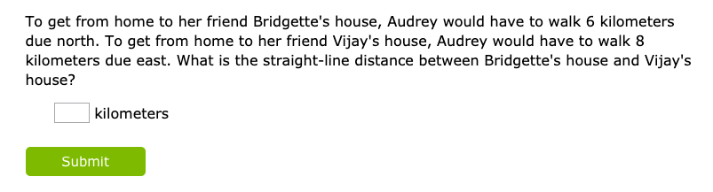

### Summary

In the Cell Tower prototype, I attempt to show how establishing a real world context for math problems can provide opportunities for students to solve problems in meaningfully different ways and provide a reason for students to collaborate and compare their solutions. This first part highlights the inspiration for creating this prototype and how my research and experiences influenced the final prototype.

[See Prototype](/prototypes/celltower)

### Design Constraints

- Meets two Common Core Standards on Pythagorean Theorem
  1. CCSS.Math.Content.8.G.B.7 - Apply the Pythagorean Theorem to determine unknown side lengths in right triangles in real-world and mathematical problems in two and three dimensions.
  1. CCSS.Math.Content.8.G.B.8 - Apply the Pythagorean Theorem to find the distance between two points in a coordinate system.
- Provides opportunities for students to take a different approach to solve the problem

### Context and Culturally Responsive Mathematics

When I taught high school chemistry, I spent a significant amount of my time taking problems from textbooks and figuring out ways to connect them to students' lives or contextualize them so that they would at the very least see how solving a problem would be relevant to a professional chemist.

Recently, I became interested to see whether there was any research supporting the efficacy of this method and stumbled upon culturally responsive teaching. While cultural responsiveness places a greater epmhasis on levearging students' existing knowledge and sociocultural background to help them solve problems, it similarly wants to contextualize a problem to make it meaningful to a student's life.

In a [summary of a research paper](https://news.ku.edu/2019/04/19/study-examines-benefits-teaching-math-culturally-responsive-ways) that analyzed 35 peer reviewed studies on culturally responsive mathematics, I found one particular finding really interesting.

> The studies also showed that culturally responsive mathematics approaches encouraged students to use their higher-level thinking skills, such as analysis, reasoning and evaluation. For example, the studies in the synthesis prepared students to use multiple strategies to solve problems and justify their solutions.

I soon found more reading on culturally responsive mathematics teaching (CRMT), including a [white paper](https://www.curriculumassociates.com/-/media/mainsite/files/ready-classroom-mathematics/ready-classroom-mathematics-cultural-responsiveness-whitepaper-2019.pdf) on the topic that highlighted one example of a "lesson focused on identifying possible locations for a new cell phone tower" to teach students the Pythagorean theorem. After reviewing the [teacher resources](https://www.scribd.com/document/366617413/tacib-cell-towers-unit?secret_password=QSO3ygjBeFnOFdO3seZ4#from_embed) provided for this lesson, I appreciated the following aspects of the unit -

1. There were many math concepts one can use to solve whether the location of a cell tower would provide coverage to residents, which was not exclusive to the Pythagorean theorem. This reinforces the finding in the research that culturally responsive mathematics can support multiple ways to solve a problem.
1. Because this was a real world problem, the unit required students to read articles about how cell phone towers worked, understand a little bit about the science behind waves and their application to information transfer ([a next gen science standard!](https://www.nextgenscience.org/dci-arrangement/ms-ps4-waves-and-their-applications-technologies-information-transfer)), and ultimately write an argumentative essay for whether a cell tower should be installed. The interdisciplinary nature of this lesson is something worth its own blog post that I hope to write about in the future. For now, I'll just highlight that from my personal teaching experiences, when trying to contextualize problems, the process often naturally leads to incorporating other subjects and skills because rarely can we solve real world problems through a single method.

I was concerned, however, that this unit would likely take one to two weeks to teach. The reality for many teachers, especially those teachers who teach math to students who are behind grade level, is they're pressured by the state assessment and making sure to cover enough material. I could imagine these teachers in particular hoping for a more bite-sized version of this lesson that they could cover in one to two days, but still contextualized the problem and provided students the opportunity to solve the main problem with different methods.

### Analysis of Current Digital Lessons on Pythagorean Theorem

With this in mind, I started researching what digital tools currently offered in terms of

For the most part, digital tools available to students offer opporunities for students to practice their use of the formula, but offer not too much context that would contextualize the concept for learners. In addition, these problems are very straightforward in how learners can solve the problem. Here are a couple examples from IXL and Khan Academy:

#### IXL - [(More Examples)](https://www.ixl.com/math/grade-7/pythagorean-theorem-find-the-length-of-the-hypotenuse)

#### Khan Academy - [(More Examples)](https://www.khanacademy.org/math/basic-geo/basic-geometry-pythagorean-theorem/geo-pythagorean-theorem/e/pythagorean_theorem_1)

These types of problems are effective for quick checks of understanding from students or for quickly teaching students how to use a formula. The trade off is that they do little to show when the pythagorean will be useful. The IXL example, in particular, feels like a forced example of trying to use a word problem to establish a context.

If we were to translate the cell tower problem to fit one of these common digital formats, it'd likely take the form of something like:

> A cell tower has a range of 4 km. Commander King is considering buying a new house. To get to the new house from the cell tower, he would need to walk 2 km east and then 3 km south. Will his new house get cell service?

This problem feels slightly better than the IXL example, but only marginally. While students can better relate to the frustration of not having cell service, they'll still rightly question why a person couldn't just test the cell service when at the new house location. Students really need to forget reality in order to make sense of the problem at hand.

The problem also still funnels the user to take a single approach. It's pretty clearn from the parameters that this is a pythagorean theorem type problem and students may be trained to apply the algorithm to the numbers provided.
