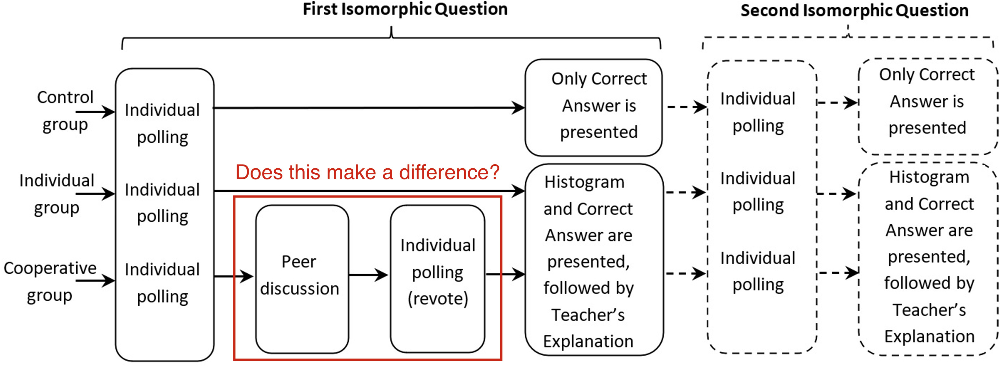

<i>
  The Goal of the research review is to highlight educational technology
  research papers from the lens of implementing
</i>

### Paper Details

<a
  target="_blank"
  href="https://www.sciencedirect.com/science/article/pii/S0360131520300841"
>
  The effect of feedback on metacognition - A randomized experiment using
  polling technology
</a>
 
<small>(Molin, Haelermans, Cabus, Groot, 2020)</small>

### Why this paper?

For educators, the paper provides insights into what type of feedback they should provide students when using polling technologies (i.e. clickers, Kahoot, Socrative, Plickers). In particular, it explores the impact of the following different types of feedback on student motivation and metacognition:

1. Only showing students the correct answer.
1. Showing students correct answer and a teacher providing an explanation.
1. Having peers provide feedback to each other and then re-answering prior to showing the correct answer and a teacher providing an explanation.

<!-- In my classroom, I used polling tools to quickly assess student understanding after explaining a particular concept. When many students incorrectly answered a question, I also could provide immediate feedback to address particular misconceptions at a whole class level. While I did this primarily as a way to assess student mastery, researchers have found that providing feedback during these activities can also lead to students developing better metacognitive skills and becoming more motivated.

In this particular study, the authors add to this reaearch by exploring whether having students provide peer feedback prior to teacher feedback could result in more significant improvements in developing students' metacognitive skills and motivation. -->

<small>Three types of feedback</small>

The student also explores whether certain student groups benefit more from one of the above types of feedback (i.e. males vs. females, low motivation vs high motivation).

### Takeaways from Results

- In groups that did both teacher feedback and

### Takeaways from Intro and Literature Review

### Scope of study

### Personal Reflection

### Further reading

Metacognition
